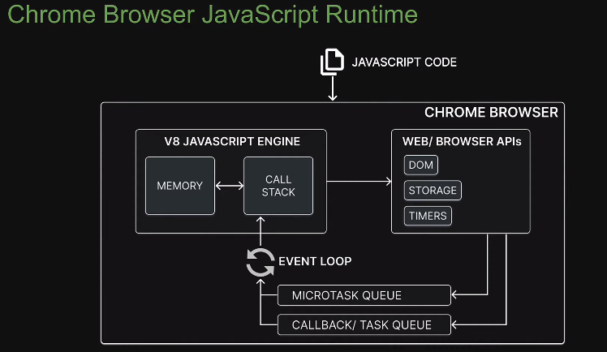

# 4. JavaScript Runtime
Created Monday 23 January 2023 at 12:52 am

- A JavaScript runtime is an environment which provides all the necessary components needed to run a JavaScript program.
- A runtime's components depend on the kind of tasks it does ("with the outside world"). For Example
	1. For a browser - the runtime consists browser APIs (DOM, Storage, Timers, etc) and other things.
	2. For a server - the runtime consists of bindings that can interface with operating system utilities.
	3. Game runtime (guess) - might consist of how to change stuff on screen, interact with the GPU, sound system. The engine would be the one running the code.
- Additionally, a runtime may also implement constructs that are not specified in the language specification, or things the standard compiler/interpreter (if something like this exists) doesn't implement.
- In case of both the Node.js and Chrome Browser, the *single threaded non-blocking* nature of JavaScript (as specified by ECMA-262) is implemented outside the engine, and as part of the runtime. The constructs which make this "nature" possible are:
	1. **Task queues** - callback (aka task) queue and the micro-task queue
	2. An **event loop** - a bridge between the engine and queues that actually runs code.

Note: 
1. Responsibilities of an engine and the runtime are not clearly defined. The only concrete thing that can be said here is that a runtime is a complete/practical thing, whereas an engine is more of a compiler.
2. I've used runtime to mean both (engine + "components of the runtime other than engine") and to mean "components of the runtime other than engine". Both are used interchangeably.

- Let's visualize the components - the engine is what converts the code to/from a language various parts of the runtime can understand. The runtime components than talk to the OS. Diagrammatically:
1. Engine <-- consumes JS
2. Engine <--> Runtime
3. Runtime <--> OS
4. OS <--> Hardware
5. Hardware <--> Outside world

In a nutshell, a JavaScript runtime is a program that let's us run JavaScript outside the browser (in the real world - meaning "all terminal commands work").