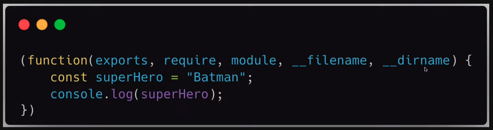
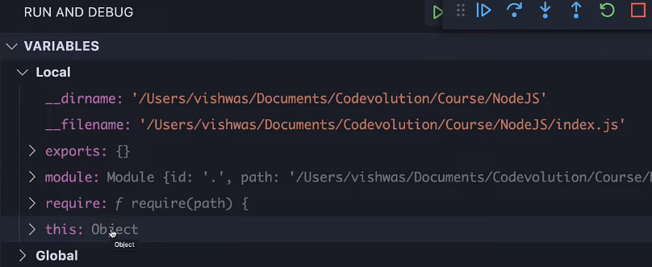

# 12. Module wrapper
Created Tuesday 24 January 2023 at 01:09 am

Q: We learnt that code inside a module is run inside an IFFE. How then, can it communicate with the outside world, especially exports and imports?
Answer: The IFFE that runs module code has some parameters that allow the module to interact with the outside world.


# Parameters of the module wrapper
So code within a module, e.g.
```js
const superHero = "Batman"
console.log(superHero);
```
runs in a wrapper with 5 parameters, like so:

In other words, `module`, `require` are not "magical" global variables. They are injected by Node.js at runtime as parameters of the module wrapper.


## About the parameters
To explore the parameters, let's use a debugger (VScode has a built-in debugger for JavaScript running in Node.js).


The parameters:
- `__dirname` - path to current module's folder
- `__filename` - path to the current module (file)
- `require` - used for importing modules
- `module` - an object representing the current module. Used for exporting stuff.
- `exports` - will study later in the section

Note: "current" means the module being executed.