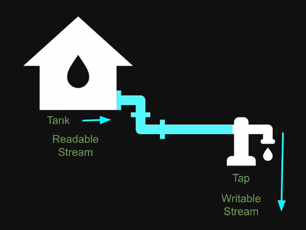

# 29. Pipes
Created Sunday 29 January 2023 at 07:36 pm

## Basic
// FIXME: rough done. Not immediately important. Just for fundamentals
In the previous lesson, we learnt about streams to read and write files.
This seems to be a common pattern in server programming and systems programming.
Node.js has a simpler and better pattern that does the same - called piping.

In non-technical terms, we understand what a pipe is. A pipe transports matter from one device to another, over some period of time.

Similarly, in Node.js, the "pipe" method connects the readable stream to a writable stream.

[Code](https://github.com/exemplar-codes/codevolution-nodejs/commit/85f89e279119f9096eddea4882f445644a58aed5)

Pipes, by their very nature are chain-able. However, only a non-writable stream can be chained. This is because all parts of a chain should update one by one, and not abruptly (i.e. its like mutating an array while traversing it, not a good idea). Here we are using writableStream, so we cannot pipe further.

To demonstrate piping, let's create a compressed file containing some text. [Code](https://github.com/exemplar-codes/codevolution-nodejs/commit/ef9cb9b25dc2ae09e63aedcad4ecbc4afa97fc42)

## Stream/pipe flow control (FIXME)
TLDR; Node.js helps a lot as a runtime
1. **Automatic Flow Control:**
   - Node.js provides automatic flow control through the built-in `stream` module. When using pipes, backpressure mechanisms are in place to handle the flow of data between readable and writable streams.

2. **Pause and Resume:**
   - If the writable stream (second buffer) encounters a situation where it can't keep up with the incoming data, it emits a 'drain' event to signal that it's ready to receive more. This event automatically pauses the readable stream (first buffer) until the writable stream is ready.

3. **Buffering Requests:**
   - If the first buffer stops receiving requests due to a near-full blocking scenario, the readable stream will pause automatically. When the situation improves, and the writable stream signals that it's ready for more data, the readable stream will automatically resume, allowing the flow to continue.

4. **Event Orchestration:**
   - Node.js orchestrates events between streams to manage flow control. The 'drain' event and automatic pausing and resuming are part of this orchestration.

5. **Handling External Events:**
   - If you need to close the entire flow due to some external event, you can do so by handling that event and closing the streams appropriately. Closing the streams will ensure that resources are released, and the entire flow is terminated.

In summary, Node.js provides automatic event orchestration and flow control between streams using backpressure mechanisms. The system can automatically handle pauses and resumes based on the readiness of the writable stream. However, it's important to handle external events appropriately to close the streams when necessary for a clean shutdown.