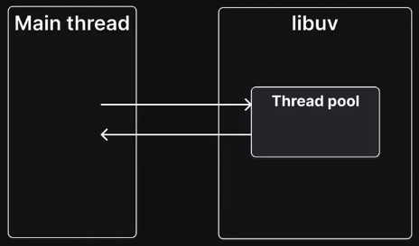
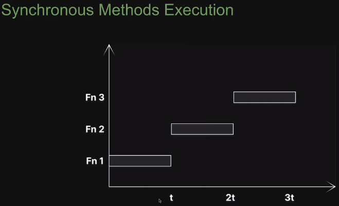

# 39. Thread pool
Created Monday 30 January 2023 at 08:55 pm
// rough
Let's learn about libuv's thread pool and the role it plays in the async non-blocking nature of Node.js.

Consider the following example:
```js
const fs = require("node:fs");

console.log("First");

fs.readFile("./file1.txt", "utf-8", (err, data) => {
	console.log("Third. Last. File contents");
})

console.log("Second");
```
It is clear that `fs.readFile` is an asynchronous and non-blocking function. But how is Node.js handling this (considering "JavaScript in simplest form") - the answer is libuv's thread pool.

---
Here's a "conversation" between the main thread and libuv:
**Main thread**: Hey libuv, I need to read file contents but that's a time consuming task. I don't want to block further code from being executed during this time. Can I offload this to you?
**Libuv**: Sure. Unlike you, who is single threaded, I have a pool of threads that I can use to run some of these time consuming tasks. When the task is done (in this case when the file contents are retrieved), then the associated callback function can be run.

This is simple.

---
libuv's thread pool, literally, is a pool of threads that Node.js uses to offload time consuming tasks and ensure the main thread is not blocked for a long time.


---
Let's do an experiment. We'll run a method and measure the time it takes to execute. 
For this we'll use a built-in module called "crypto" (the module provides cryptographic utilities).  "crypto" has some functions that are time consuming and are therefore handled by libuv. One such function is `pbkdf2`.

### Experiment 1 - synchronous version
On using the synchronous version of this function. [Code](https://github.com/exemplar-codes/codevolution-nodejs/commit/dcfd578a0d3b779a8e4b0f4a756031fe028f547d)

Inferences:
- Time increases linearly with number of calls - obvious. 
- Each call takes the same time, irrespective of the total number of calls made.

Each method in Node.js that has the "sync" suffix always runs on the main thread and is blocking.


### Experiment 2 - async version