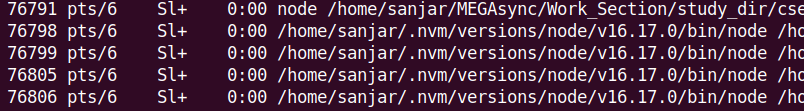

# 61. Cluster module
Created Saturday 11 February 2023 at 05:20 pm

## Why (situation)
- Node.js is single threaded for JS code it runs. From a performance POV, this is fine if the app is I/O or network intensive, but might struggle if there are CPU intensive ops.
- To help with this "CPU intensive" blocking problem, Node.js introduced the "cluster" module.

Example [code](https://github.com/exemplar-codes/codevolution-nodejs/commit/3b9332dd272f02d7d9bbb13d54d79eb42977c0f4):
```js
const http = require("node:http");

const server = http.createServer((req, res) => {
  res.writeHead(200, { "Content-Type": "text/plain" });

  if (req.url === "/") res.end("Home page");
  else if (req.url === "/slow-page") {
    for (let i = 0; i < 6e9; i++) {} // slow op
    res.end("Slow page");
  }
});

server.listen(8000, () => console.log("Server is running on port 8000"));
```

On my current computer, fast page takes 3 ms and slow page takes 6 seconds (when run individually).

Now, if we first run (in the browser) slow-page and then quickly run fast page in a second tab. The slow-page takes 6 seconds (same), but the fast page also takes ~6 seconds (if we open the second tab fast).

Why does the fast page slow down (3 ms --> 6 s)? The reason is quite obvious, because the "slow page" had a slow operation. While the first request was being worked on, the second request came in but the CPU was busy - it got queued (since it's a callback) but had to wait. In fact, all requests will have to wait if  one is being processed. This is bad.


## How (does it work)
- The cluster module enables the creation of child processes (also called workers) that run *simultaneously*.
- All created workers share the same server port.
- Each worker has it's own runtime (FIXME: mostly), as it's a process.


More details:
- When we run a script in Node.js, it is run as a "cluster master".
- The "master" is only in-charge of managing "workers", i.e. it's responsibility is starting and stopping "workers". It doesn't (not supposed to?) run the app code.
- Workers are in charge of handling app code - handling  requests, reading files etc.
- Each worker gets it's own **event loop**, **memory** and **V8 instance**. Running 4 workers (with a master, obviously).


Let's play with this. [Code](https://github.com/exemplar-codes/codevolution-nodejs/commit/0bc07a91b3c124d4b1ca1a41046183920f81ffee).


## What (syntax)
- cluster is a built-in module. It still needs to be imported, of course.
- `cluster.isMaster` is used to check if the instance is a master or worker.
- `cluster.fork()` is used to create a worker. This `fork` function is absent in workers. *This implies that there can only be one master for a port*.

How many clusters to create? Depends on the app. At max, create as many as the CPU cores on the machine. If we create more workers than there are logical cores, it can cause a significant performance overhead. The built-in "os" module can be used to [check](https://github.com/exemplar-codes/codevolution-nodejs/commit/a3c7e07e22a70f9c3ff2f81b9fd0c952f8c730dc) number of cores on the machine:
```js
const os = require("node:os");
console.log(os.cpus().length);
```


## PM2 (package) for dynamic cluster management
- PM@ is a 3rd party Node.js package.
- It manages clusters in an optimal way, dynamically.
- As it manages clusters, there's no need for master code, and so, no need to import or use the`cluster` module. Just run a app code file as usual, using `pm2` instead of `node` command.

PM2 is installed globally. Syntax - start, stop, delete, list, monit:
```bash
## Start - start/resume
pm2 start index.js -i 0 # dynamic mode, manage number of workers automatically and optimally
pm2 start index.js -i 2 # static mode, run fixed number of workers

## Stop, actually pause
pm2 stop index.js       # Note: pm2 remembers stopped workers
pm2 stop all

# Stop, permanently, i.e. stop
pm2 delete index.js     # Note: also clear pm2's memory
pm2 delete all

# List - name, cpu and memory usage
pm2 list index.js
pm2 list all

# Monitor - detailed stats
pm2 monit index.js
pm2 monit all
```
