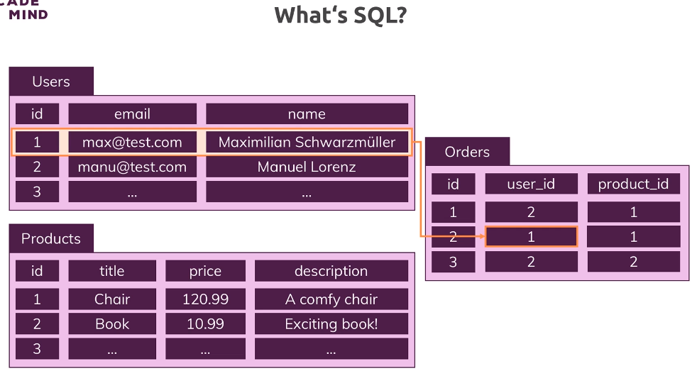
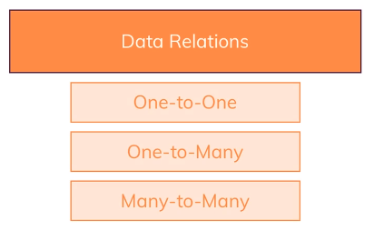
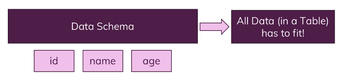
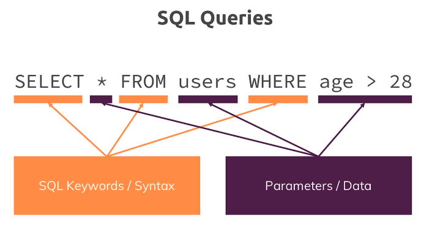
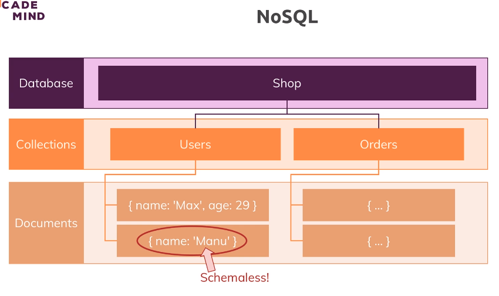
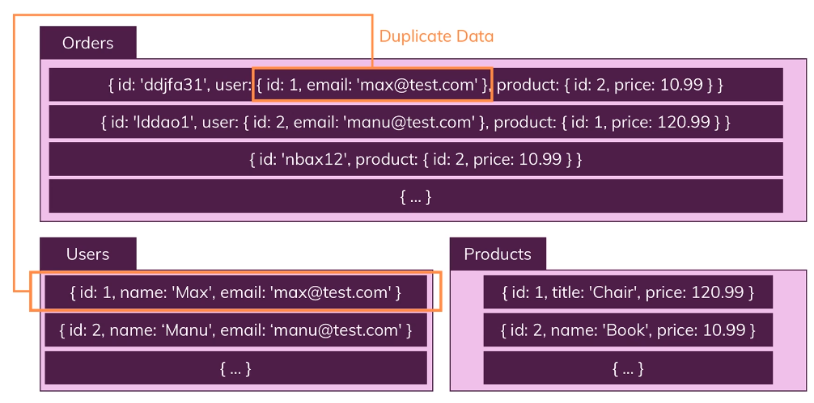
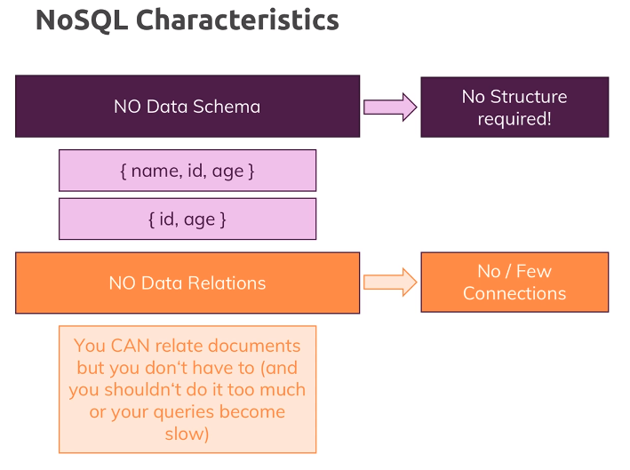

# 136. Choosing a Database
Created Tuesday 21 March 2023 at 12:43 am

Our goals for a database are:
1. Easy to use - for the developer
2. Performance

## Types of databases
There are many classifications possible. A simple one is based on if a database has SQL like language and "relational nature". 

The two types are:
- SQL - SQL like. Relational. Examples - MySQL, PostgreSQL
- NoSQL - not like SQL database. Examples - MongoDB, Neo4j

## "SQL" databases
SQL (Structured Query Language) is a language and specification for a database.

There are many implementations of SQL. These implementations (i.e. database softwares) are called "SQL database". More generally, any database that has "relational" characteristics is usually tagged as an "SQL database".

Fundamental philosophies of "SQL" databases":
1. The primary construct is the "table". A table contains rows (aka records). 

Preview

   
   

2. Tables can have relations - one-one, one-to-many, many-to-many. 

Preview

   
   

3. Table schemas are strictly enforced. 

Preview

   
   

4. High level language is [SQL](https://en.wikipedia.org/wiki/SQL) like. 

Preview
 

Note: A "database" is a collection of "tables", that have relations between them.

## "NoSQL" databases
*NoSQL* database simply means not a *SQL* database

Fundamental philosophies of most "NoSQL" databases":
1. There is the "database", just like with a "SQL" database
2. A database has *collections*. A collection is the equivalent of a "table" (in SQL database). A collection has *documents* (equivalent to a *record/row* in a *table*). 

Preview
 

3. Collections usually have **no relations** between each other. Duplication is preferred over relations (this can be a significant advantage for unstructured data, and also if *joins* are undesirable). 

Preview
 

4. Documents in a collection don't adhere to a schema. There's some level of similarity, but it's not strictly enforced. A document may look like a JavaScript object (FIXME? why so). 

Preview
 
