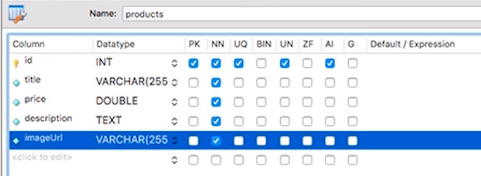

# 140. Connecting our App to the SQL database
Created Wednesday 22 March 2023 at 01:37 am

#### Note
- This is not specific to an "app". This page is a general method to connect any Node.js code (script, app etc) to the SQL database (software) running (independently) on the machine.
- Yes, MySQL (or any other database software) keeps running independent of the Node.js code. It's generally never stopped.

## mysql2
- This is the "database driver" - i.e. a package with code that helps us communicate with the database. 
- Practically, it allows us to run raw SQL queries in our Node.js code.
- The basic idea is to obtain a "connection" object using the package. This "connection" is used for all interaction with the database, as well as closing the connection.
- This code to connect to the database is usually kept separate from the application code, in a utility file (like the path utility we have [now](https://github.com/exemplar-codes/online-shop-express-ejs-mvc/tree/d18ab604acb9ac5509949d9e185ccaf6f3a2ba14/util)).


## Connecting to the database
There are two ways to do this:
1. Create a "connection" - a single use (i.e. one query) object. This is imperative, and inefficient from both a development and performance POV.
2. Create a so called "connection pool". An object that supports an unlimited number of queries - like a prompt. 
   
Note: Of course, it's asynchronous w.r.t JavaScript, but single-threaded externally - (i.e. one query will be processed at a time) w.r.t the database.
   
Code for obtaining a connection:
```js
const mysql = require("mysql2");
const pool = mysql.createPool({
  host: "localhost",
  user: "root",
  database: "node-complete",
  password: 'my-password',
});

module.exports = pool.promise();
```

---
### Running SQL queries
For that first create a table, using MySQL Workbench.

### Create a table
1. Go to 'node-complete' schema we created (in the left sidebar), and create a table named "products".
2. Add fields of the table
	1. Add "id", of type "INT". It should also be a primary key (PK), should be Not Null (NN), Unique (UN), unsigned (UN), auto-incrementing (AI). Leave others unchecked.
	2. Add "title", type "VARCHAR(255)". Not null.
	3. Add "price", type "DOUBLE". Not null.
	4. Add "description", type "TEXT" (a little bigger than VARCHAR). Should be Not Null.
	5. Add "imageUrl", type "VARCHAR(255)". Not null.
3. Click on apply. This shows a preview of the SQL query that will be run. Proceed.

### Add some products
1. In the left sidebar, go to the database, the table, and click the rightmost icon.
2. Add values in the first row. ID is optional (it will be assigned automatically if not specified). Click apply.



### Node.js code
```js
const db = require("./database");

(async () => {
  try {
    const response = await db.execute("SELECT * FROM products");

    const resultRows = response[0];
    console.log(resultRows); // array, with each element as object form of the row.
  } catch (error) {
    console.log(error);
  }
})();
```
The first element in the output is an array of resultant rows.

[Code - creating connectionPool, executing queries](https://github.com/exemplar-codes/online-shop-express-ejs-mvc/commit/65d8d045c5bacd9699215eaf7f1a7b5bba231b46)