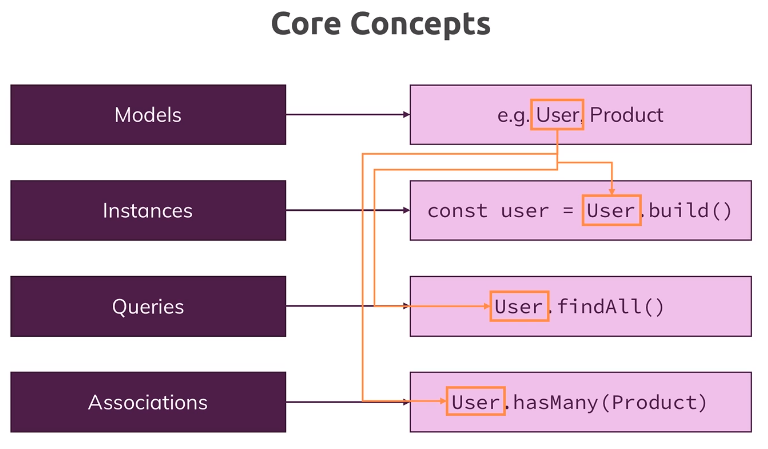

# 150. Sequelize concepts
Created Friday 24 March 2023 at 10:00 pm

The most important (and used) concepts in Sequelize are:
1. Models
2. Instances
3. Queries
4. Associations

---
Helpful maybe (Sequelize overview) [2-ORMs-sequelize-chatgpt.pdf](/assets/2-ORMs-sequelize-chatgpt.pdf)