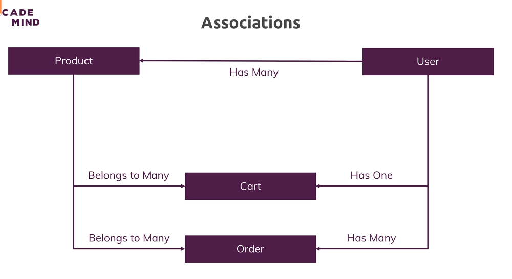

# 162. Associations
Created Sunday 16 April 2023 at 02:02 pm

A user is related to other data in our shop - cart, products etc. Sequelize supports creation of such associations. There are 3 basic kinds of associations (between models/tables):
1. One to one - each record in table A is related to at most one record in table B.
2. One to many
3. Many to many

/rough START
## Sequelize associations (basics)
- **Source and target model** - s.someRelation(t) where s and t are source and target. This has nothing to do with foreign key placement, since it's determined by the relation too. s and t just make it easier to specify the order of arguments (since s.someRelation(t) is *similar* to someRelation.call(this, s, t))
- **Placement of foreign key**.
	- A.has*(B) - FK placed in B
	- A.belong*(A) - FK placed in A
- Recommended way to create associations - use relations in pair. Syntax for the basic 3
	1. 1-1 - `A.hasOne(B); B.belongsTo(A)`
	2. 1-N - `A.hasMany(B); B.belongsTo(A)`
	3. Many-many - `A.belongsToMany(B, { through: 'ABjunction' }); B.belongsToMany(A, { through: 'ABjunction' });` <details><summary>String/object</summary>Note, through can be a string, or even a model we defined (the foreign keys for both will be added to it automatically). This is actually better since we can add extra data here (i.e. in the junction table). If a string is passed, a junction model is still created, but has to be accessed via one of the participating models (doesn't exist in our code directly).</details>
	Why pairs - pairs make sure both model *know* about the relation, and have to have auto-generated (aka mixins) methods to get associated stuff from both sides.
- Yes, N-M notation is **weird** here. We are using `belongsToMany` 2 times, instead of `hasMany` with `belongsToMany`. eway: use the latter, then change `hasMany` to `belongsToMany`.
- **Default lifecycle hooks** - by default, Sequelize has 'SET NULL' for deletion and 'CASCADE' for updation operation.
	
## Sequelize association (medium)
- **Multiple associations between the same 2 models** are *possible*. For this, pass an `as` (alias) config (second argument of .has* or .belongs*). **This helps in establishing semantic difference at the JS/ORM level**. Example - A task is created by a user, and assigned to a user, at an office. The relations are between user and task, but there's a semantic difference.
- **Foreign key name** - The foreign key names are automatically decided by Sequelize, but can be specified using the `foreignKey` option (second argument of .has* or .belongs*). This is very helpful to convey "tangible relation/action". Example -there are students and an equal number chairs in a classroom. It's better to use a FK named `seatedBy` than `userId`.
- **Association based on field other than FK** - we've had associations between models that used FK. But it's possible to create associations based on a non FK field too. **However**, this requires the field to be **unique**. Why do this? - doing this makes the generated mixins more tangible (example if username was used for the association instead of userid - we'd have mixins like `.getUsername()`, which is more useful compared to `.getUserid()`). Syntax:
	```js
	Person.hasOne(B, { sourceKey: '' }); // sourceKey here since it's the one being copied (to B)
	B.belongsTo(A, { targetKey: '' });
	
	// ommitting either side means use id for that side, i.e. id <--> someField
	```

Note: the option argument (2nd argument) here is referring to the `target`. e.g. `Product.belongsTo(User, { onDelete: 'CASCADE'} )` means talking about the deletion of target (i.e. User), and what happens to the source (Product) when this happens.

## Sequelize association (advanced)
#todo read-from-docs
- More granular eager loading

## Sequelize association querying
- Sequelize adds mixins to get associated models of the model being queried. Example:
	```js
	User.hasMany(Account);
	Account.belongsTo(User);

	// the following functions are now available (on instances)
	user.getAccounts();
	account.getUser();
	```
- Lazy vs eager load - when a model is queried, it's associated models are not returned (by default), and another call needs to be made using the mixin. This can be overriden, and the associated model(s) can be fetched in the fetch call itself, by using the `include` keyword as query option (i.e. object passed as second argument)
- Sequelize does not support direct manipulation of associated models, i.e. it has to be done in explicit steps. Exception - Creation of a new model (with associated models) is possible, if they too are new.

/rough end

We wish to have the following relations between the model, in this project.


- [User and Product association code](https://github.com/exemplar-codes/online-shop-express-ejs-mvc/commit/d7e46fbcef2b5a7e9d91702001c4fd11c1f0322b)
- [Populating each model, individually - code](https://github.com/exemplar-codes/online-shop-express-ejs-mvc/commit/8dad6ea2abe25bdf2956949d5da6c991b5d07a8d) `afterSync` at model level.
- [Populating models with association, after sync all](https://github.com/exemplar-codes/online-shop-express-ejs-mvc/commit/c7d20e75ed1c82b5d977ee0d81ff3ecdf44b64ec) `afterBulkSync` at global level

## Stuff learnt from the above
1. Associated tables have cannot are associated at SQL level too, and hence, have to deleted in proper order. Example - User table cannot be deleted here, if Product table exists.
2. `afterSync` at model level, runs after the model has been synced. The hook is also available at the global level, but here, again, it runs once for each model. Code:
	```js
	// afterSync at model level
	const sequelize = require('../util/database.js')
	const User = sequelize.define('user', {/*columns*/}, 
	{
	  hooks: {
	    afterSync: async function (){},
	  }
	})
	```
	```js
	// afterSync at global level
	const sequelize = new Sequelize('node-complete', 'root', 'password',
	{
	  host: '',...
	  
	  hooks: {
	    afterSync: async function (){}, // runs once for each model
	  }
	})

	module.exports = sequelize;
	/*
	This can be source of pesky errors, especially if the hook uses multiple models. The reason is that not all models have been synced, when this runs and 'table does not exist' error may come up (if a has not synced yet).

	The correct way to run code that uses multiple models, after sync, is to use `afterBulkSync`, globally of course.
	*/
	```
3. Circular dependency issues: Here I want to pre-populate data, by creating a user with two associated product. To avoid 'table not found errors', I use the `afterBulkSync` hook. The problem now is that I cannot import `User` and `Product` model at the top, since I'm in the `sequelize` (instance) file, which is used by every model.
   
   One way to fix this is to import the models inside the hook, and not at the top level. This fixes the issue because when the hook runs, all models have synced, and their exports have been cached (Node.js's default behavior), so importing them is fine now. Code:
	```js
	// const User = require('./models/User'); ERROR - circular
	
	const sequelize = new Sequelize('node-complete', 'root', 'password',
	{
	  host: '',...
	  
	  hooks: {
	    afterBulkSync: async function (){
		    const User = require('./models/User'); // Okay here
	    },
	  }
	})

	module.exports = sequelize;
	```
	#todo #fixme this is not ideal. Find a way to add the setup code without such nested (not top level) imports.
4. Creating associated models - there are multiple (cosmetic and otherwise) ways to created associated models. There are 3 cases:
	1. All models exist, independently - Use the `add*` mixin. Example: 
		```js
		await user.addProducts([prodInstance1, prodInstance2])
		// FYI: associating PK works too, example: id

		await user.addProduct([prodInstance])
		// PK works fine too
		```
	2. Some models don't exist (assume 1 does not exist) - Use the `create*` mixin. Example:
		```js
		await user.createProduct(prodPlainObject1);
		await user.createProduct(prodPlainObject2);
	
		// Note: apparently, user.createProducts mixin does not exist
		// there may be other ways to do this in one go, maybe setProducts?. FIXME
		```
	3. None of the models exist. A one liner is possible here. Example:
		```js
		await User.create(
		{
			...userPlainObj,
			[Sequelize.Utils.pluralize(Product.name)]: [prodObj1, prodObj2],
			// FYI: these could be model instances too
		},
		{ include: [{ model: Product }] }
		);
		// include is the lazy-load control construct of Sequelize, it can be used in queries too
		```
5. Automatic dissociation - just make the new association. Why this works: Associating an instance from one associated instance to another (of the same type) will automatically remove the old association. Examples:
	```js
	const prod1 = await Product...; // assume this is associated with user1
	
	const user2 = await User...;
	user2.addProduct(prod1); // prod1 is now associated with user2, not user1.
	```
6. Dissociating explicitly - use appropriate mixin. Examples:
	```js
	// dissociate for 1-1 or 'one' side of 1-N
	await product.setUser(null);
	// product.removeUser(); // doesn't work. there's no such function. Use set (above).

	// dis + destr. Fact: There's no one liner.
	product;
	const userId = product.userId;
	await product.setUser(null);
	await User.destroy({ where: { id: userId } });


	// dissociate for N-M or 'many' side of 1-N
	// PKs or instances both work (can be passed)
	await user.removeProduct(prodInstance.id); // dissociate one
	
	await user.removeProducts([prodInstance1.id, prodInstance2.id]); // dissociate multiple
	
	await user.setProducts([]); // dissociate all


	// dis + destr for many. Fact: There's no one liner.
	user.removeProducts([1, 2, 3]); // or .removeProduct
	Product.destroy({where: id: [1, 2, 3}); // or single id

	//  dis + destr for many. Remove all. Fact: have to fetch all products (ids)
	const productIds = (await user.getProducts({ attributes: ["id"] })).map((item) => item.id);
	user.setProducts([]); // better than .removeProducts(productIds)
	Product.destroy({where: { id: productIds }})
	```

---

Verifying my understanding [3-SQL-and-ORM-Relations-chatgpt-7cfdfbab-d682-4aba-be6b-7a519c15abb0.pdf](/assets/3-SQL-and-ORM-Relations-chatgpt-7cfdfbab-d682-4aba-be6b-7a519c15abb0.pdf)