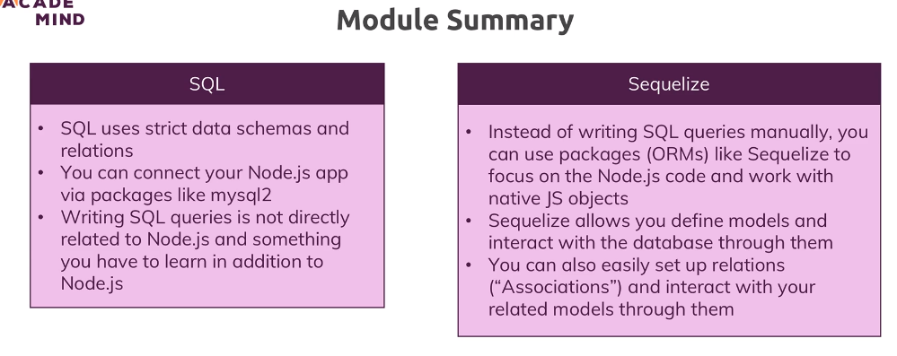

# 174. Wrap up
Created Tuesday 2 May 2023 at 03:27 am

1. SQL and databases - an organized way to work with persistent data.
2. ORMs are declarative (code in JS instead of SQL) tools that allow us to to database operations (reads/writes) without writing raw SQL.
	- They are a partial layer of abstraction, i.e. one does need to think in terms of FKs, tables, indexes when *creating models*, at least. To be exact, the model creation ORM code may need to be thought from the SQL level.
	- Query part of ORMs are a very practical abstraction though.
3. We explored Sequelize here
	- It supports associations
	- It supports hooks, but only at the model level. It does not have constructs for observing and reacting when a associated model changes.
	- Model have methods/attributes
		- Fixed (will always be present) - both static and instance methods/properties. Examples: `User.create()`, `User.fetchAll()`
		- Magic ones - these are methods/properties that mostly get attached based on the model name, and associated models. They are determined by associations the model has. Example: `user.createCart()`, `user.getProducts()`
	  
