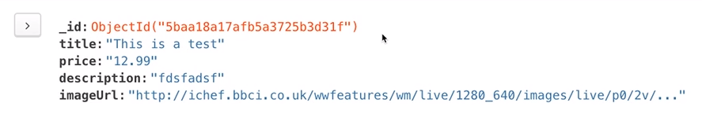

# Fetching products and `_id`
Created Friday 19 May 2023 at 02:08 am

## Fetching all products (for index page)
```js
class Product {
	// some code here
	
  static fetchAll() {
    const db = getDb();
    return db
      .collection('products')
      .find() // has generator behavior by default
      .toArray() // to avoid? generator behavior of `find`
      .then(products => {
        console.log(products);
        return products;
      })
      .catch(err => {
        console.log(err);
      });
  }
}
```

Syntax for find all:
```js
const prdocust = await db.collection('collection_name').find().toArray();
```

Note: 
1. `next` - `.find` in MongoDB has generator like behavior, and supports a chainable function `.next()` that returns the next "page" (as in pagination). This is relevant since databases could have millions of documents. Syntax: `.find().next()`
2. `toArray` - `.find()` in MongoDB has a chainable function `toArray()`  that converts the response to a proper JS array. This is needed since the default `.find()` is not a proper array.


## Fetching a single product
```js
class Product {
// some code here
  static findById(prodId) {
	const db = getDb();
	
	const prodId; /*  = some code here*/;
	const product = 
	await db.collection('products')
		.findOne({ _id: prodId }); // _id should be used
	
	return product;
  }
}
```

Syntax for find one:
```js
const product = await db.collection('products').findOne({ _id: prodId });
```
This doesn't work, though. Let's explore why.


### `_id` object
This code doesn't work because `_id` stored inside a MongoDB document is not of type string, and therefore comparison (equal) won't work. 

`_id` is actually a special object, specified by MongoDB. It's not a native JS feature. 


Why is the `_id` like this? Reasons:
1. It is easy to work with in BSON
2. Has the property of uniqueness
3. `_id` generated after (in time) has higher alphabetical rank than ones created before.
4. And more..


### Fixing the code
- MongoDB provides utility method to create `_id` objects.
```js
...find({ _id: prodId }) // doesn't work


const mongodb = require("mongodb");
...find({ _id: new mongodb.ObjectId(prodId)}); // works
```

Read is easy, `product._id` will work fine, where `product` is the fetched Product.