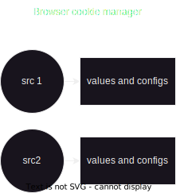

# 231. Cookies and Session Fundamentals
Created Wed Oct 4, 2023 at 9:42 AM

https://github.com/sanjar-notes/backend/blob/d7878820f76ec345fdfd5aa0ff69b5f5f0305516/home/4_resource_itineraries/2_Cookies_Hussein_Nasser/1_HTTP_Cookies_Crash_Course.md - all about cookies.

Know that Cookies and sessions are unrelated principally, but they are used in conjunction.
## Cookies (fundam)
1. What are cookies - client side storage for a site without need of JS. Cookies are data sent on every relevant request automatically by the browser as a header. mAid: Think of them as convenience data that's expendable.
2. Setting cookies:
	- Cookies may be set by the server
	- Cookies may be set by the client
	- A cookie has a value and a config
	- Cookies may be invalidated by the server or the client JS (unless it cannot access it). Of course, invalidation through browser internal UI (manually) is always possible.
	- Note: browser level UI (manual) is not scriptable. 
3. Getting cookies (at the server) -  Cookies may be set by the client such that client side JS cannot access it (access through browser internal UI is still possible)
4. Learnings
	1. Browser UI (tabs, pages, components) - components (tags) interact with their own cookies, and have nothing to do with the page src
		   
	2. Omni-bar src is a special case of course. This needs protection, since everyone has access to `open(someLink`) in JS (CSRF). More: It's feels like an exception, where we shouldn't "send" the cookies. But, it's still within the "src" primary identifier realm, since the link component or .open (the page console) can be treated as a component. And components shouldn't be able to create a situation where they affect cookie get/set for other src. Of course, if the components came in the HTML, that's fine. However, since anchor tag is a major component, we should be able to relax this rule (which was the default). But strict mode is now available.
	3. Browser cookie manager - For the cookie manager, the primary identifier is "src"
		

## Sessions (fundam)
1. Definition - A way to implement auth without need for credentials (password) on each request.
2. USP - basic principle of defense against auth stealing (cookies, token)
3. Flow - 
### Implementation
The current (above) flow involves a database call, which is expensive to do for each and every request

On the other hand, a simple decryption of a string is a fas operation. So instead of the using a table (database), we could encrypt the user details (user_id here) using a key that's only known to the server.

Note: if you don't want to involve encryption, sessions are still a valid concept (send the id unencrypted - it's a random string anyway). But you'll need to maintain a database.

### Optimization 1 - we don't need a table
The current (above) flow involves a database call, which is expensive to do for each and every request

On the other hand, a simple decryption of a string is a fas operation. So instead of the using a table (database), we could encrypt the user details (user_id here) using a key that's only known to the server.

Note: if you don't want to involve encryption, sessions are still a valid concept (send the id unencrypted - it's a random string anyway). But you'll need to maintain a database.

### Optimization 2 - send token back with each response
To prevent cookie stealing (which takes some human time), we can change the session encryption key each day (or some other period).

But why send the token back for every request - well, when the key changes, all existing sessions will be invalidated, forcing the user to sign in again (in order to generate a fresh token). This can be annoying for the user.

Instead we can potentially send new session token with each response. Potentially meaning we would send the same token if it's valid, but if the token is valid and the time is nearing for key change, we'll generate a new token and send that instead.

This way, we can prevent the force login issue
for a majority of users. A small number of users
will have to login again, of course - if they were inactive when the session encryption key has changed in that time.

### What's the role of a cookie in all this?
Since we forego the need for username and password for each request, the client would need to send the session token (encrypted user data) for each request.

JS cannot be used to do this, since the first call would never be authenticated (the page doesn't exist, let alone using `fetch` API).

Even for SPA calls, adding logic to send and receive cookies would be tiring. 

Fortunately cookies allow us to do all this (including on first page load). So it's both convenient and required.