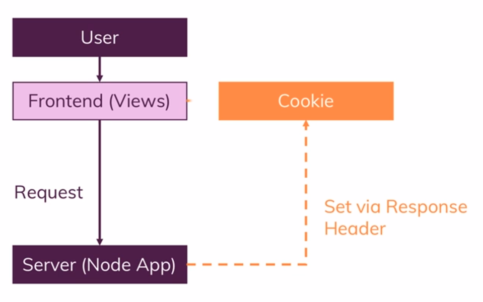

# 231. What is a Cookie?
Created Sunday 25 June 2023 at 08:01 pm

note: I'm not trying to give a hard definition.

Suppose we have a web app which has user authentication (simple log in). The expected requirements of such an app include:
1. User shouldn't have to sign in each time they visit the app
2. User should be able to see that they are logged in or not.
3. User should be logged out after a certain event - generally a timeout. By "logged out", I mean requests fail and redirects to the login page.

## Cookie
1. Cookies are browser level storage that can be controllable by servers (i.e. the website).

- Cookies can be used for many purposes, one of which is persistent authentication ("logged in state"). Cookies uses for this are also called "authentication cookies".
- Cookies can be manipulated by the user and front-end code too.
2. Another important aspect of a cookie is that it is included in every request that's made to the website.

## Sessions (not started)
A session is the server side counterpart of a cookie. It may be stored in a database or otherwise.

An "authentication session" is the counterpart of a "authentication cookie".