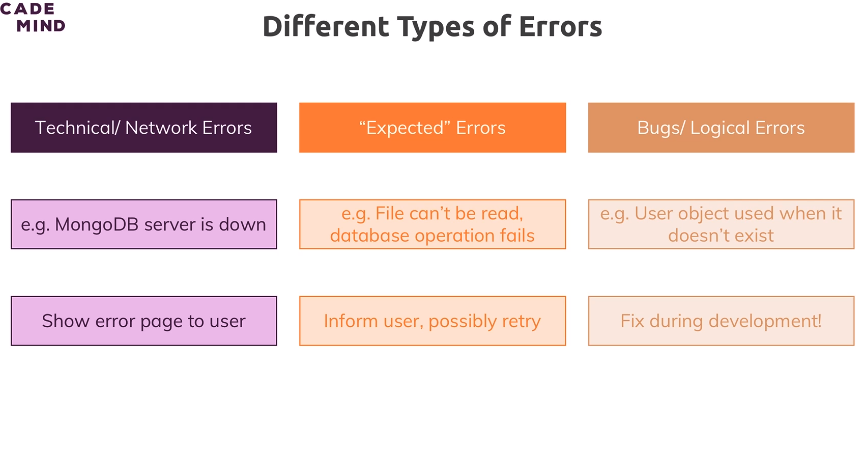
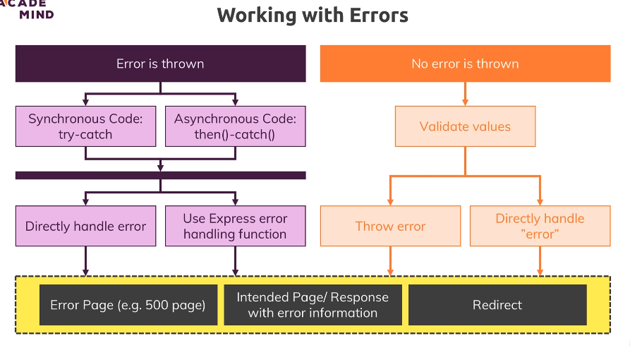

# 306. Module intro and the error sink

Code branch link (started a new one): https://github.com/exemplar-codes/online-shop-nodejs-branches/tree/19-error-handling ("19-error-handling")

[height.app task link](https://height.app/OitGt6StRG/T-180)

---

## Errors - existence and mindset
There are many types of errors
- Errors are inevitable in a backend app. Some are deliberately designed by us for logging, and as info for the user.
- The correct mindset here is to "handle" errors appropriately.


## Types of errors
Types of errors with examples of reason and how to deal with them:



## Dealing with errors - app wide structure
There are two things usually done for dealing with errors:
1. The error "sink" - Have a function whose job is to catch error for any unhandled error. This could is essentially like a `try catch` for the whole app.
	- It's the job of this sink to build and send at-least a generic error response using the bubbled Error object (e.g. `Error` in JS).
	- sometimes errors are deliberately thrown by us, so that this "sink" catches it and responds to the user with the message.
	- This also prevents a hard-crash of our app (i.e. the Node process dying).
1. Semantic checks - these are pieces of code that deliberately throw an error when something goes wrong semantically (as opposed to syntax error, development error or external errors). Of course, the "sink" catches these too.
	- Sometimes, the semantic checks may formulate the response themselves, instead of throwing an error. Example - username is taken (request is sign up) isn't a generic error, and may need special handling - like redirecting to the login page (since the user may be trying to log in, instead of sign up).
	- These are usually found inside the context or flow of a feature.

Note:
- the sink is a system - not a single fixed function, it may have multiple error catches and formulate error responses, and even actions (like redirect).
- The sink has to take care of two things no matter what - the error message and the action (redirect from a invalid form is bad UX) it takes.
- Express.js does provide a built-in feature for error handling.

Picture - left side is the sink, right side are the checks (and it's two variants).



## How to throw errors in JS (ignorable)
already learnt in core Node playlist (Codevolution). But still:
```js
throw new Error('error message here') // btw, behaves like `return`
```