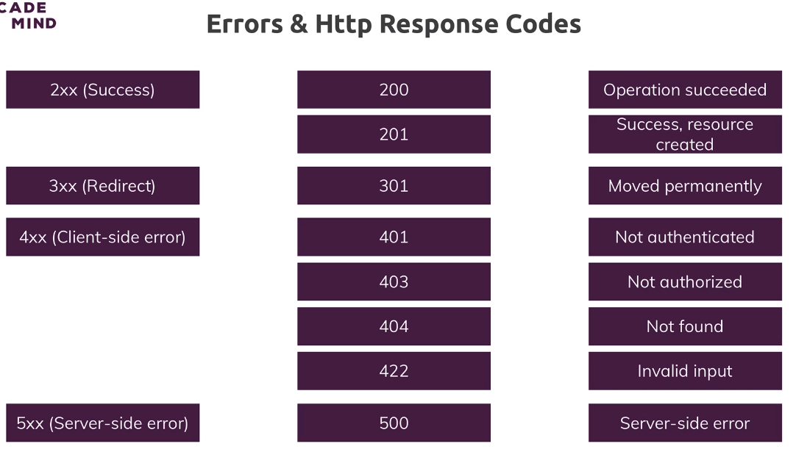

# 315.  HTTP status codes
Created Wednesday 23 August 2023

## What and why are status codes?
- These are codes sent in the response (by the server).
- They help the browser know what's going on, in showing error popups.
- They also help with general web app debugging, logging etc.


## Classes of status codes
The 4 most important classes of status codes are:
1. 2xx - success
2. 3xx - redirect
3. 4xx - client-side error
4. 5xx - server-side error



For the complete list of codes, see https://httpstatuses.com/


## How to send a status code in Express
- If response will be built further:
	```js
	app.use((req, res, next) => {
	  res.statusCode = 200;
	
	  // continue building the response
	});
	```
- if response ready to send (chaining)
	```js
	app.use((req, res, next) => {
	  res.status(200).send('All good');
	});
	```

note: 
- For redirection with status code (default is 302)
	- Pass code as the first param - `res.redirect(301, '/path')`
	- Already covered in Express"responses" fundamental section, btw [66_Responses](../5_Express_js/66_Responses.md#4-convenience-functions).