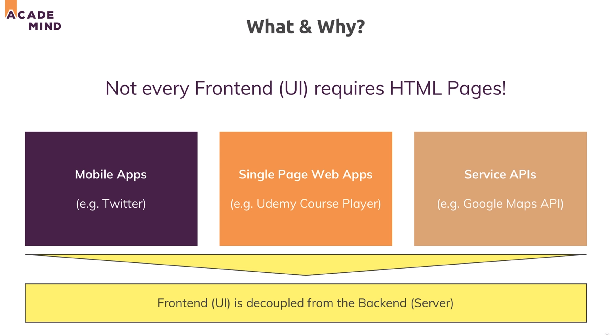
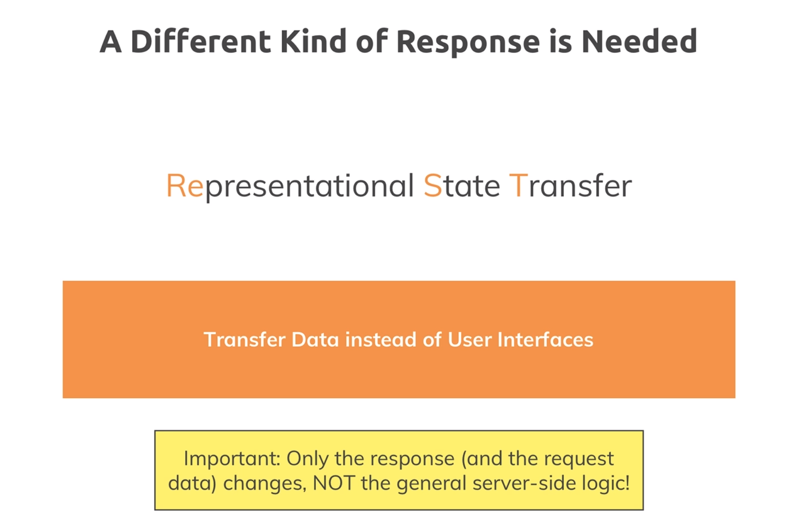

# 359. Module intro
Created Mon Sep 11, 2023 at 9:44 AM

## Sending pages isn't the norm
We have been sending whole pages (HTML using EJS) back as responses in this course. 

But:
1. SPAs and mobile apps - this is not how modern apps (SPA web apps, mobile) apps usually work. They (the client) get the UI inflating code at the start, and subsequent interactions with the server are mostly about data (not UI). This makes them fast and responsive. Example - React web apps, Mobile apps - React Native, native Android apps
2. Server side apps - servers don't run browsers (since UI is not a feature here), and so server to server communication doesn't involve pages. The messages sent back and forth are mostly objects, in various standardized formats.

## APIs (Application Programming Interface)
APIs in the context of web apps refer to backend apps that interact with a UI client, or another server. The expected inputs from the "client" are:
1. URI (path and query params)
2. Body (optional)
3. Headers

## REST APIs term in the course (optional)
This course uses the term "REST API" for server apps that don't send UI content. This is wrong, since REST is a disciplinary construct/recommendation about how to build APIs.

I understand why it does so. Because REST APIs are the most common kind of web APIs, and most people are familiar with the term.

fine.

## Do I specially need to learn such APIs
No, all we have learnt so far is mostly applicable as is. It's just that we'll:
1. Send data without the UI
2. Will need to design API endpoints a little smartly