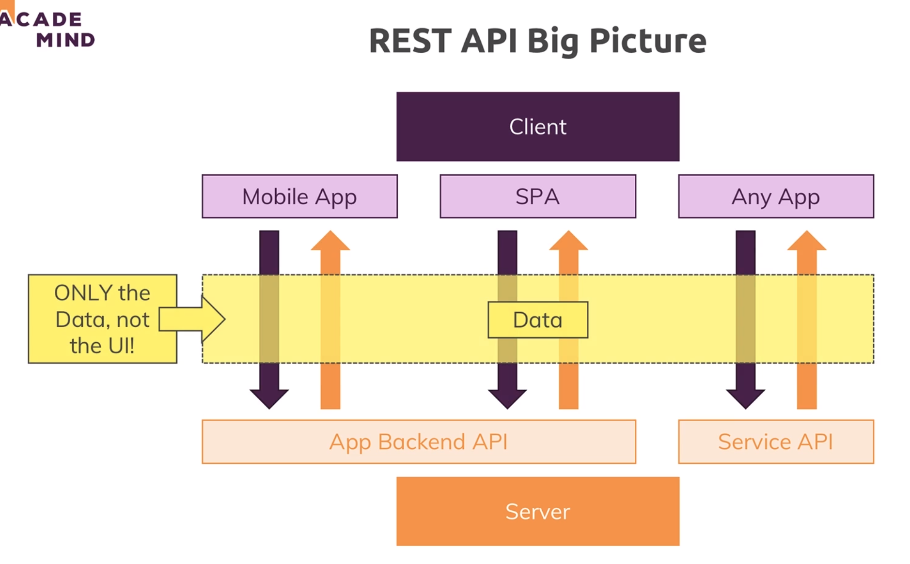

# 360. API general flow
Created Mon Sep 11, 2023 at 10:25 AM

## Client and server
- The client may be a mobile app, a web app or even a server. It may even be a customer's client, or their server (our business modal could be selling access to our API).
- The REST API (aka API) resides in the backend app.

