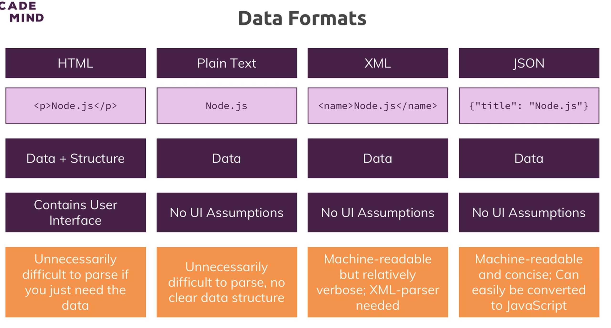

# 361. API Data formats
Created Mon Sep 11, 2023 at 10:30 AM

So APIs are about exchanging data (as opposed to UI/UI+data). But in what format?

## Common formats
1. HTML - is primarily for browsers. not very useful for inter-server comms.
2. Plain text - very general, not good for computers.
3. XML - custom tags. a little setup/maintenance overhead.
4. JSON - both human readable and structured (machine readable). one-to-one correlation with JS objects.  **simplest and good for both humans and machines**. [official website](https://www.json.org/)
5. ProtoBuf (Protocol Buffer) - binary format, structured. Meant for high traffic, realtime stuff where payload size and/or speed matters. Some setup needed, like XML.

A comparison

## Practically best format - JSON
JSON is the simplest format and performance is good enough for common applications. It's the goto format for user facing apps.

Reasons:
1. Human readable - helps with debugging
2. Machine readable
3. Simple syntax
4. Browser support by default. 
5. Universal JS engine support - Node.js supports JSON (essentially any system with a JS engine). It also works with most backend frameworks in other langs as well.

Cons (applicable for fast/high load systems):
1. Serialization/deserialization cost - In fast and/or high traffic apps, this can become significant, since JSON is human readable. ProtoBuf are a binary format that are very fast in this regard.
2. Size of payload - JSON has larger size than a binary format like Protobuf.