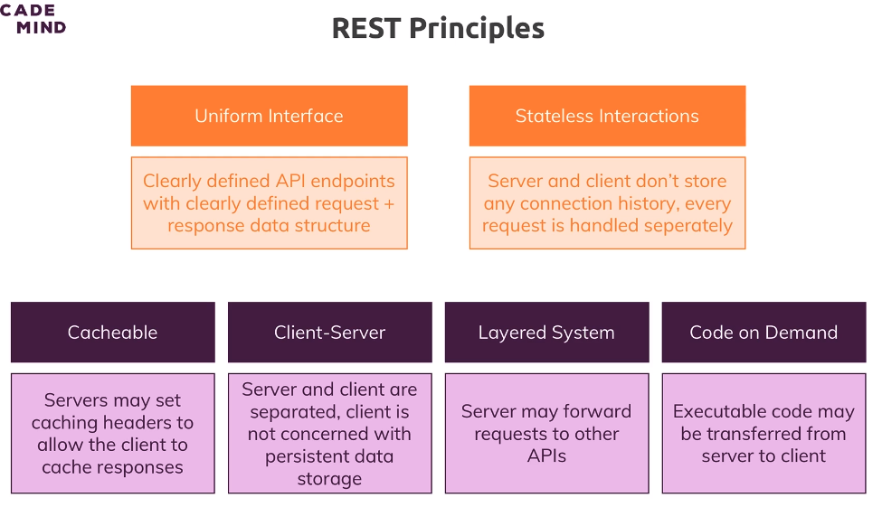

# 363. REST core principles
Created Thu Sep 14, 2023 at 12:46 AM

note: these are informal but import REST core principles

## What is REST
REST is an *architecture style* to develop web services, which uses the HTTP protocol as a communication interface in order to transfer data through HTTP methods.

> The name “Representational State Transfer” is intended to evoke an image of how a well-designed Web application behaves: a network of web pages (a virtual state-machine), where the user progresses through the application by selecting links (state transitions), resulting in the next page (representing the next state of the application) being transferred to the user and rendered for their use.
> &mdash; Roy Fielding, 2000

## Principles of REST
A RESTful system should have these major traits:
1. Uniform Interface - clearly defined endpoints, request structure and response structure. This means documentation of course.
2. Resources over *commands* - the client specifies resources to be CRUD, instead of sending commands/code to the server. See  [SOAP](https://www.reddit.com/r/learnprogramming/comments/u2erbr/comment/i4j8f6d/?utm_source=share&utm_medium=web2x&context=3).
3. Statelessness
   
Minor:
4. Separation of client and server
5. Cacheable
6. Layered system - the server could actually be a group of servers working together (including delegation)
7. Code on demand - the server may sent executable code to the client.

note: **statelessness** is the only non-trivial thing here. I knew other things already.
### 2. Client and server separation
In the REST architectural style, the implementation of the client and the implementation of the server can be done independently without each knowing about the other.

This means that the code on the client side can be changed at any time without affecting the operation of the server, and the code on the server side can be changed without affecting the operation of the client.

As long as each side knows what format of messages to send to the other, they can be kept modular and separate.
### 3. Stateless
RESTful systems should be stateless, meaning that server doesn't need to know what state the client is in and vice versa. Consequently, neither save history/previous calls (atleast in a way that affects present calls).

## Advantages of REST
1. **Simplicity** - the code and documentation become easy and implicit.
2. **Reliability** - each component (*resource provider?*) is limited, so errors are easy to log and debug.
3. **Quick performance** - since each resource has it's own limited scope of change.
4. **Scalability** - each component can be scaled without affecting the system. Example - multiple clients (including multiple types like web, mobile) could use the same backend server.
5. **Flexibility** - any component (it's code) of the system can be changed without affecting the system. This can be done even if the system is running, since statelessness is assumed.