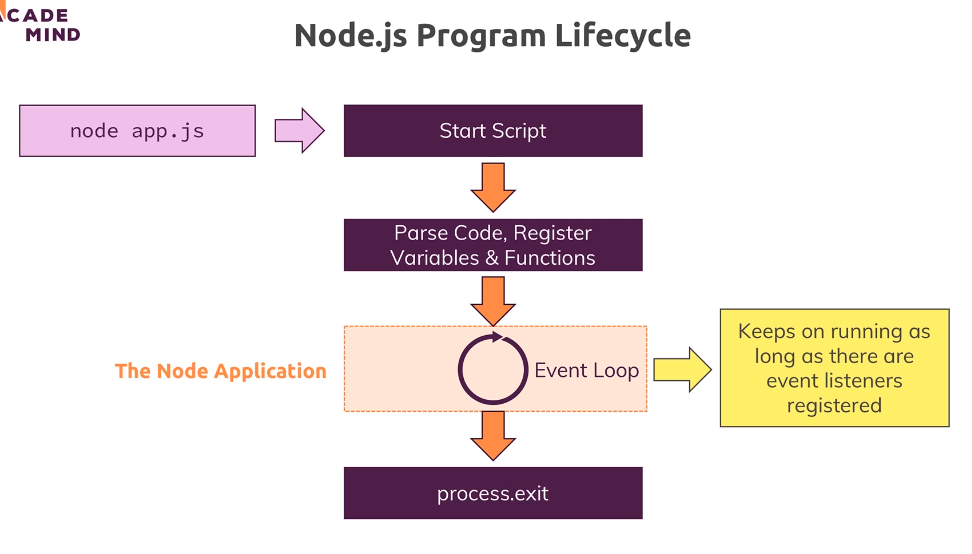

# 27. The Node lifecycle and Event loop
Created Monday 13 February 2023 at 09:26 pm

## Life-cycle
- Node.js uses 3 constructs to execute code - stack (+ heap), event loop and the task queue.
	- Process starts using the `node` command, usually ("pm2"?).
	- All JS code is executed on the **stack**.
	- **Event loop** becomes active only when all synchronous code has finished running.
	- **Task queue** is populated from the beginning, but starts functioning only when the event loop becomes active.
	- The Node.js process ends when all tasks in the task queue have finished executing, or if there's an explicit exit.

Note: Pressing Ctrl + C also ends the process.

## Terminating scripts and the process
- `process.exit()` is used terminate a Node.js process. `process` is available globally.
- `return` (by itself, outside a function) is used to exit the current script being run.

Neither are used in general.