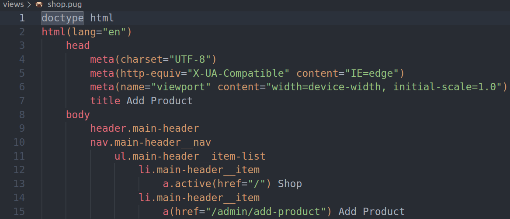
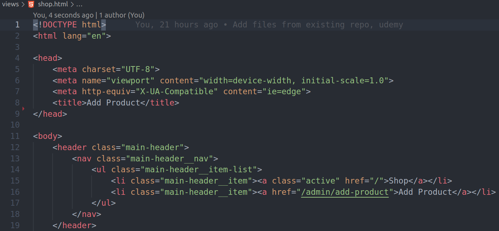

# 81. Installing Pug and using it
Created Sunday 5 March 2023 at 10:22 pm

## Install, connect, use with Express.js
1. `npm install pug`
2. `app.set('view engine', 'pug')` - set view engine. The argument `'pug'` works because pug *automatically* registers with express.
3. `app.set('views', 'path_to_templates_folder')` - set views folder. Optional (default is `my-project/views`).
4. `res.render('my_template_name')` - .pug extension is optional if engine `pug` is set. Can also pass in path to template file, if `"views"` Express app settings in unset.


## Pug syntax
Pug syntax is simple, concise.
1. Indentation matters, no closing tags, no angled brackets
2. class is specified with chained dot notation `div.my-class`. Same with id (with `#`)
3. attributes directly after tag (and classes) inside parentheses.
4. `div` is the default tag, if no tag is specified.

Example (Pug, vs HTML):



Code (same as above):
```pug
doctype html
html(lang="en")
    head
        meta(charset="UTF-8")
        meta(http-equiv="X-UA-Compatible" content="IE=edge")
        meta(name="viewport" content="width=device-width, initial-scale=1.0")
        title Add Product
    body
        header.main-header
        nav.main-header__nav
            ul.main-header__item-list
                li.main-header__item
                    a.active(href="/") Shop
                li.main-header__item
                    a(href="/admin/add-product") Add Product
```
```html
<!DOCTYPE html>
<html lang="en">

<head>
    <meta charset="UTF-8">
    <meta name="viewport" content="width=device-width, initial-scale=1.0">
    <meta http-equiv="X-UA-Compatible" content="ie=edge">
    <title>Document</title>
</head>

<body>
    <header class="main-header">
        <nav class="main-header__nav">
            <ul class="main-header__item-list">
                <li class="main-header__item"><a class="active" href="/">Shop</a></li>
                <li class="main-header__item"><a href="/admin/add-product">Add Product</a></li>
            </ul>
        </nav>
    </header>
</body>
```

Note: 
- In VScode:
	- Pug auto-completion works out of the box. 
	- There's no built-in formatter, however. An [extension](https://marketplace.visualstudio.com/items?itemName=ducfilan.pug-formatter) is available though.

[Code until here](https://github.com/exemplar-codes/templating-engines-w-express-js/commit/2ec3459c867b46cb703b5daf2b0d4f6c8f8013dc)

## Dynamic content
Placeholders and dynamic content is the primary goal of a template engine. Let's see how to do that with Pug (and Express).

- Pass *props* - `res.render('my-template-file', props)`. Example - `res.render('my-template-file', { docTitle: "Sanjar's", ratings: [5, 1, 5, 4] })`
- Consume props - prop values are accessible globally inside the template using keys, no import needed.

DSL:
1. Renderable type - `#{placeholder_name}`
	```pug
	title #{docTitle}
	```
2. Iterate, use the `each` and `in` keyword provided by Pug. No imports needed, of course.
	```pug
	h1 Ratings
	div.grid
	    each product in prods
	        article.card.product-item
	            header.card__header
	                h2.product__title #{product.title}
	```

See [docs](https://pugjs.org/api/getting-started.html) for more DSL constructs

Note:
- to convert HTML to Pug, use https://html-to-pug.com
- functions can be passed as props, and can be called inside the placeholder construct. Parentheses are required for function call, as is usual in JS.
- The props passing syntax - `res.render('my-template-file', props)` is same with any template engine.